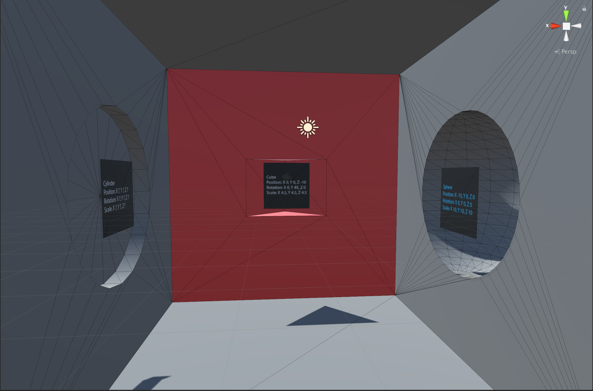

# assignment2
## ARTTECH 4135-001
## Virtual Reality

In this assignment you will start with the github classroom link, create your own assignment repository, clone it to your computer, make modifications to the unity project, commit the changes, and push back the updated repository to github.

## Required software:

- [Unity 3d](https://unity3d.com/get-unity/download)
- [GitHub Desktop](https://desktop.github.com)

## Potential Resources:

- YouTube Videos on Unity and GitHub
	- [How to use GitHub with Unity](https://youtu.be/qpXxcvS-g3g)

- Lynda.com
	- Learning Git and GitHub
	- Unity 3D Essential Training

## Learning Outcomes
- Creation of github repository from github classroom link.
- Clone of repository on local resource.
- Modification of Unity project.
	- Addition of 3D shapes.
	- Creation of materials.
	- Addition of folders and assets (texturemaps)
- Committing changes to Unity project and pushing to remote github repository.
---

---
## Directions
1. Accept the GitHub classroom assignment via link provided in slack.

2. On a local resource clone the newly created repository.

3. Modify the Unity project by adding shapes to the scene, to fill the matching shape and orientations.
	1. Add a cube to the scene (e.g 4.5 units scale), a rotation of 45 on Y axis
	2. Add a sphere (radius 10) to the scene, and place it in the sphere shape area
	3. Add a cylinder to the scene, and find out the right dimensions and orientation to match the cylinder area in Unity
4. Commit changes to repository, remember to add a useful commit message.
5. Push committed changes to github, I will look for commit messages in the repository.
6. Change the color of the sphere to red.
7. Add a texturemap of your choice to the cube.
8. Make the cylinder a green semitransparent color.
9. Commit changes to repository, remember to add a useful commit message. 	
10. Push committed changes to github.

---
11. Create a folder called Images
12. Take a screenshot of your scene (like the example below)
12. Name the image assignment_01-finished.png
13. Add the image into the the Images directory
14. Commit changes to repository, add a commit message: "screenshot added". 	
15. Push committed changes to github.

## Example image of a finished project

